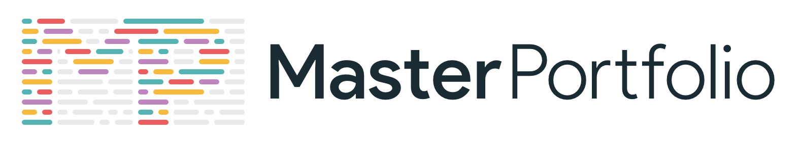

<p align="center"> 
    </img>
</p>

<h1 align="center"> Software Developer Master Portfolio 🔥 </h1> 
<h3 align="center"> A clean, beautiful, responsive and 100% customizable portfolio <br /> template for Software Developers! </h3>

---

## 🛠️ Tech Stack

This project has been upgraded to a modern development workflow:

- **Frontend:** React 18.2
- **Build Tool:** [Vite](https://vitejs.dev/) (Fast & Lightweight)
- **Styling:** Styled Components, Bootstrap, Sass (Dart Sass)
- **Animations:** React Reveal, React Spring
- **Data:** GraphQL, Apollo Client

---

## 🚀 Getting Started

### Prerequisites

- **Node.js:** Current LTS version recommended.

### Installation

Due to the use of legacy animation libraries, use the following command to install dependencies:

```bash
npm install --legacy-peer-deps
```

### Development

Start the local development server:

```bash
npm run dev
```

The app will be available at `http://localhost:3000`.

### Build

Build the project for production:

```bash
npm run build
```

The production-ready files will be in the `build/` directory.

---

## 🎨 Customization

The entire portfolio is data-driven. To update your personal information, open:
**`src/portfolio.js`**

Modify the constants like `greeting`, `socialMediaLinks`, `skills`, `degrees`, etc., to reflect your own profile.

---

## 🌐 Deployment

This project is optimized for deployment on **Vercel** or **GitHub Pages**.

**Vercel Note:**

- Framework Preset: **Vite**
- Output Directory: **`build`**
- Build Command: **`npm run build`**
- Install Command: **`npm install --legacy-peer-deps`**

---

## 📜 License

This project is licensed under the MIT License - see the [LICENSE.md](./LICENSE) file for details.

## 👏🏻 References

- Some Design and Implementation Ideas are taken from [Saad Pasta's Portfolio Project](https://github.com/saadpasta/developerFolio).
- The Logo of MasterPortfolio is inspired from [prettier-logo](https://github.com/prettier/prettier-logo) for [prettier](https://github.com/prettier/prettier) designed by @ianstormtaylor.
